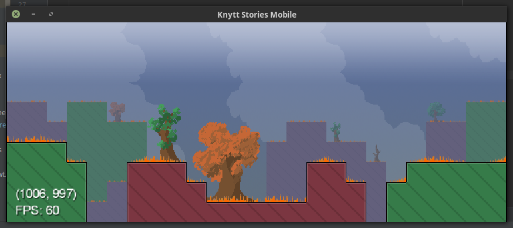

# Knytt Stories Mobile

Knytt Stories Mobile (KSM) is a port of the Windows game [Knytt Stories by Nifflas](https://nifflas.ni2.se/games/) based on the source code of [Knytt Stories DS by Rodrigo Roman](http://www.rodrigoroman.com/rrc2soft/nds_dsknytt.html).

### How to Play

Currently, Knytt Stories Mobile functionality is limited to viewing level scenery of regular Knytt Stories levels only. Knytt Stories+ levels are *not currently supported*.

#### Desktop:

On desktop, create a folder in your home directory named `Knytt Stories Mobile`. Inside this directory, place *already extracted* Knytt Stories level folders. At this time, KSM is hardcoded to load **The Machine** by Nifflas; however any regular Knytt Stories level should work. *A level selection screen is high priority, in progress, and should be implemented within the near future*.

Use the arrow keys on the keyboard to navigate the screens.

#### Android:

On Android, create a folder in the root of your phone's storage titled `Knytt Stories Mobile`. If your phone has internal storage, this will be the default. Otherwise, use the SD card. Place an *already extracted* Knytt Stories level inside the `Knytt Stories Mobile folder`. Afterwards, you will need to manually enable Storage permissions for the app `Knytt Stories Mobile` in the device settings. From here, you may launch the game. At this time, there are no controls implemented for the Android version. This is high-priority and will be implemented in an immediate-future update.

### To do list:

The following items are not an exhaustive list, but things that I think are of importance for game functionality. The list will be updated from time to time, so check back to see what is and isn't working.

- Finish base modularization of all currently-completed components. Right now, tilesets and data assembly need to be modularized.
- Upscale the resolution of the game and menu screen to be 720p+
- Implement on-screen controls for Android and iOS.
- Implement menu screen with level selection, and level extraction (downloading capabilities may be of immediate priority as well).
- Implement Juni.
- Revise onscreen controls for Juni.
- Implement per-pixel collision of layer-3 with Juni.
- Implement objects (VERY time-consuming, and will take some considerable time to accomplish).
